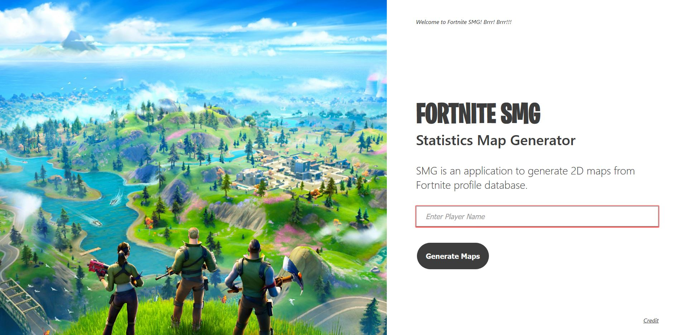
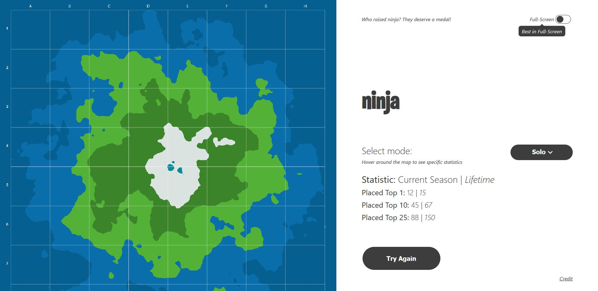

##  **FORTNITE-SMG**
### SMG is an application to generate 2D maps from Fortnite profile database.
> An Advanced Web And Interactive Practice Project by Muhammad Syafiq Imran

### SMG Features
- [x] Access to the latest desired Fortnite player statistics.
- [x] Unique interactive map generator for three popular mode.
- [x] Announcer, full-screen recommendation and responsive layout.

## Get Started
Fortnite SMG is a web application designed to provide users a unique generated map from the statistic record of Fortnite players across the globe. In this web application, user will able to interact with the output to observe a specific set of data.

#### 1. Who are you looking for?

```Enter Player Name``` in the text input form.<br><br>
<br><br>
and click ```Generate Maps```.

#### 2. Voilà, the Fortnite 2D Map is generated!

Hover around the map to see specific statistics.<br><br>
<br><br>
By default, this map is generate from Solo mode statistics, but you can select ```Solo```, ```Duo``` or ```Squad``` mode if you like to.<br><br> Click ```Try Again``` to use the web application with different Fortnite player account.

## What is happening?
So, the input that being request by you will be integrated with web API engine and they get the player statistics from Fortnite database. Based on mode, the data will be use to generate the map.<br><br>

<a rel="license" href="http://creativecommons.org/licenses/by-nc-nd/4.0/"></a><br>
This work is licensed under a
<a rel="license" href="http://creativecommons.org/licenses/by-nc-nd/4.0/">
Creative Commons Attribution-NonCommercial-NoDerivatives 4.0 International License</a>.

## Reference
> Barney Whiteman. [Barney]. (2018, June 18). *Coding Challenge #10 2D Terrain Generation using Perlin Noise*. Youtube. <br>&nbsp;&nbsp;&nbsp;&nbsp;https://www.youtube.com/watch?v=jv6YT9pPIHw<br><br>
> Daniel Shiffman. (n.d.). *Introduction*. The Nature of Code.<br>&nbsp;&nbsp;&nbsp;&nbsp;https://natureofcode.com/book/introduction/<br><br>
> Daniel Shiffman. [The Coding Train]. (2016, May 4). *Coding Challenge #11: 3D Terrain Generation with Perlin Noise in <br>&nbsp;&nbsp;&nbsp;&nbsp;Processing*. Youtube. https://www.youtube.com/watch?v=IKB1hWWedMk<br><br>
> *noise()*. (n.d.). Processing.<br>&nbsp;&nbsp;&nbsp;&nbsp;https://processing.org/reference/noise_.html<br><br>
> Yvan Scher. (2017). *Playing with Perlin Noise: Generating Realistic Archipelagos*. Medium.<br>&nbsp;&nbsp;&nbsp;&nbsp;https://medium.com/@yvanscher/playing-with-perlin-noise-generating-realistic-archipelagos-b59f004d8401

## Source

> Web API
Fornite-API by elreco : https://rapidapi.com/elreco/api/fortnite-api

Font
> Burbank Big Condensed Bold by Fonts Market : https://www.fontsmarket.com/font-details/burbank-big-condensed-bold<br>
> Lato by Google Fonts : https://fonts.google.com/specimen/Lato

Icon
> Material Icons by Google : https://google.github.io/material-design-icons/

Images
> Fortnite Chapter 2 Wallpaper : https://wallpapersden.com/fortnite-battle-royale-chapter-2-wallpaper<br>
> Fortnite Llama Wallpaper : https://dlpng.com/png/6412080

Licence
> Attribution-NonCommercial-NoDerivatives 4.0 International by Common Creative : https://creativecommons.org/licenses/by-nc-nd/4.0/

## Resource
> RapidApi : https://rapidapi.com/elreco/api/fortnite-api<br>
> Processing : https://processing.org/<br>
> jQuery : https://jquery.com/<br>

## Appendix
> Adobe XD Prototype : https://xd.adobe.com/view/3d5a2fc1-bee1-4c3a-4c59-31ebec249b9c-4b6b/<br>
> Proposal & Progress Presentation : https://docs.google.com/presentation/d/1Fe1H20jUz5jI7e9vfIkcqHmffNkegfRClWvsTMKeYXw/edit?usp=sharing
