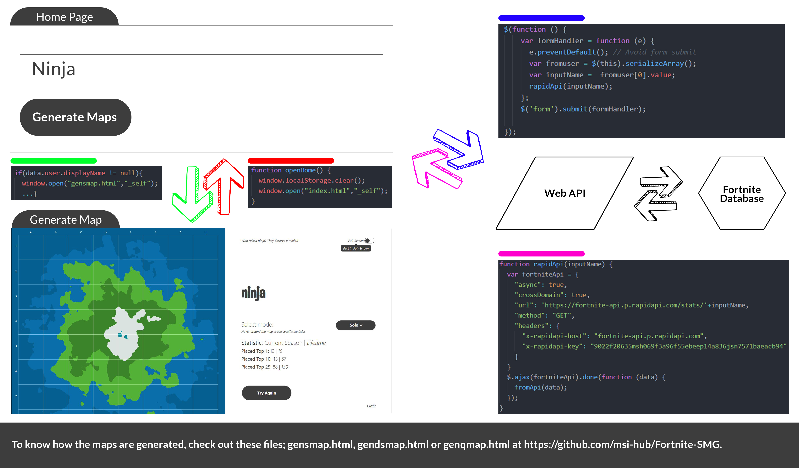

##  **FORTNITE-SMG**
> An Advanced Web And Interactive Practice Project by Muhammad Syafiq Imran
### SMG is an application to generate 2D maps from Fortnite profile database.

## Get Started
Fortnite SMG is a web application designed to provide users a unique generated map from the statistic record of Fortnite players across the globe. In this web application, user will able to interact with the output to observe a specific set of data.

#### 1. Who are you looking for?

```Enter Player Name``` in the text input form.<br><br>
<br><br>
and click ```Generate Maps```.

#### 2. Voilà, you got your own Fortnite 2D Map!

Hover around the map to see specific statistics.<br><br>
<br><br>
By default, this map is generate from Solo mode statistics, but you can select ```Solo```, ```Duo``` or ```Squad``` mode if you like to.<br><br> Click ```Try Again``` to use the web application with different Fortnite player statistics.

###### What is happening?
> So, the input that being request by you will be integrated with web API engine and they get the player database. Based on mode, the data will be use to generate the map.<br><br>

##### License

<a rel="license" href="http://creativecommons.org/licenses/by-nc-nd/4.0/"></a><br>
This work is licensed under a
<a rel="license" href="http://creativecommons.org/licenses/by-nc-nd/4.0/">
Creative Commons Attribution-NonCommercial-NoDerivatives 4.0 International License</a>.

###### Take this portal if you are looking for <a href="credit.md">Fortnite-SMG's Notes & Credit</a>.
